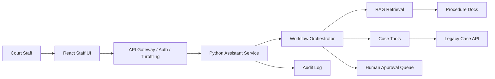

# Architecture

## Key Design Decisions

- Keep the assistant outside the legacy monolith.
- Require RBAC checks before tool execution.
- Ground answers in procedure documents.
- Treat write actions as approval-gated.
- Log every request, retrieval hit, tool call, and action decision.
- Start with simple local components, then replace them with managed services.

## Production Mapping

| Local MVP | Production Target |
| --- | --- |
| Static JSON case data | Legacy Java case-management APIs |
| Local text policy docs | S3/OpenSearch/pgvector knowledge base |
| In-memory approval queue | PostgreSQL/DynamoDB workflow table |
| Console logs | CloudWatch + OpenTelemetry |
| Local auth headers | OIDC/SAML + API Gateway authorizer |

## RAG Notes

The MVP uses Markdown policy files and a local lexical index. For case workflow
questions, retrieval is enriched with case context after the mock legacy lookup.
See `docs/rag-design.md` for the current retrieval design and vector-store
upgrade path.

## Workflow Notes

The assistant orchestration is modeled as explicit workflow nodes in
`backend/app/workflow.py`. See `docs/workflow-design.md` for the node path and
LangGraph upgrade plan.

## Frontend Notes

The staff UI is an operations workspace with role context, workflow trace,
citations, approvals, and admin audit visibility. See `docs/frontend-design.md`
for the demo flow and UI rationale.
